Lab 6: Correlation
================

This session is concerned with summary statistics for interpoint correlation (i.e. dependence between points).
The lecturer's R script is [available here](https://raw.githubusercontent.com/spatstat/SSAI2017/master/Scripts/script06.R) (right click and save).

### Exercise 1

The `swedishpines` dataset was recorded in a study plot in a large forest. We shall assume the pattern is stationary.

Before we begin, we plot the data:

``` r
plot(swedishpines, main = "")
```

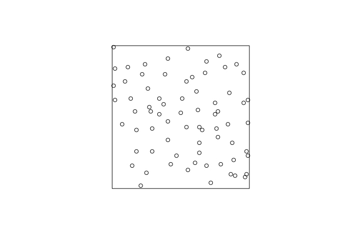

1.  Calculate the estimate of the *K*-function using `Kest`.

    The estimation is done with:

    ``` r
    K <- Kest(swedishpines)
    ```

2.  Plot the estimate of *K*(*r*) against *r*

    To plot the K-function, we do:

    ``` r
    plot(K, main = "K-function")
    ```

    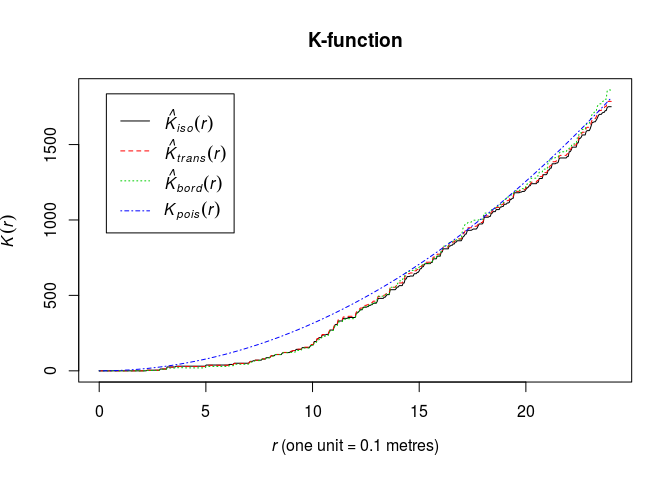

3.  Plot the estimate of *K*(*r*)−*π**r*<sup>2</sup> against *r*.

    The estimated K-function subtracted *π**r*<sup>2</sup> can be done via the `fmla` (formula) interface:

    ``` r
    plot(K, . - pi*r^2 ~ r, main = "Normalized K-function",
         legendpos = "bottomright")
    ```

    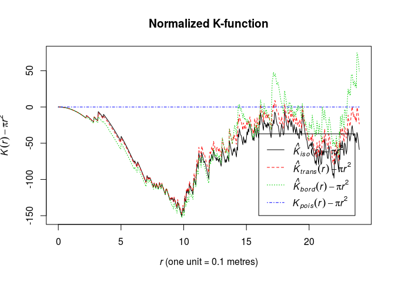

4.  Calculate the estimate of the *L*-function and plot it against *r*.

    Like the K-function, we estimate the L-function in the same manner:

    ``` r
    L <- Lest(swedishpines)
    plot(L, main = "L-function")
    ```

    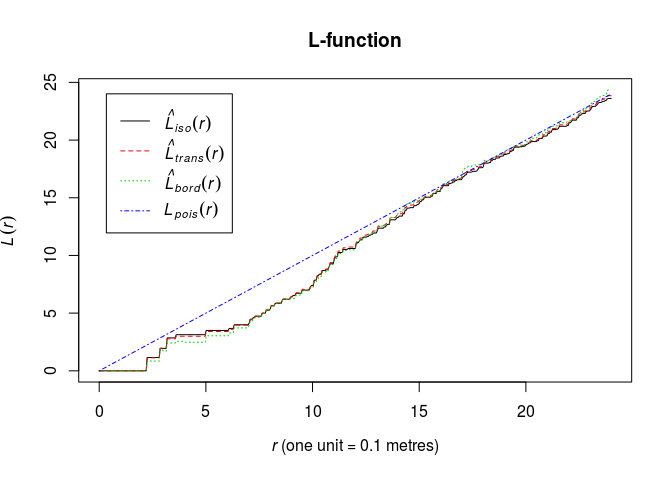

5.  Plot the estimate of *L*(*r*)−*r* against *r*.

    Like before:

    ``` r
    plot(L, . - r ~ r, main = "L-function")
    ```

    

6.  Calculate and plot an estimate of the pair correlation function using `pcf`.

    The pair-correlation is also compute straight-forwardly:

    ``` r
    pcorf <- pcf(swedishpines)
    plot(pcorf)
    ```

    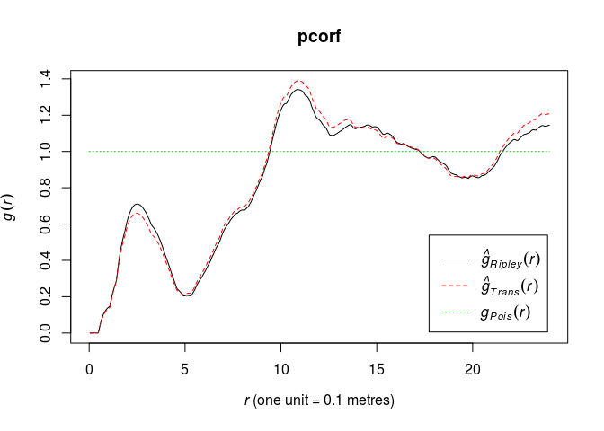

7.  Draw tentative conclusions from these plots about interpoint interaction in the data.

    Assuming a homogeneous point pattern, both the L- and K-function are less what is expected under the Poisson process the data. Thus they indicate a comparatively regular point pattern. Similarly, the pair-correlation function also suggests this.

### Exercise 2

1.  Generate Fry Plots for the Swedish Pines data using the two commands

    ``` r
    fryplot(swedishpines)
    fryplot(swedishpines, width=50)
    ```

    OK,

    ``` r
    par(mar=rep(0,4), mfrow=c(1,2))
    fryplot(swedishpines)
    fryplot(swedishpines, width=50)
    ```

    

2.  What can you interpret from these plots?

    The leftmost plot is somewhat misleading as the limiting observation window come into play. That the density tapers off here is effectively an edge effect. Looking at the rightmost plot, we see a slight dip in density of points near the center. This again indicate a regular point pattern, however, the data is somewhat sparse in the latter plot.

### Exercise 3

The `japanesepines` dataset is believed to exhibit spatial inhomogeneity. The question is whether, after allowing for inhomogeneity, there is still evidence of interpoint interaction. We will use the inhomogeneous *K*-function.

1.  Compute the inhomogeneous *K* function using the default estimate of intensity (a leave-one-out kernel smoother) with heavy smoothing:

    ``` r
    KiS <- Kinhom(japanesepines, sigma=0.1)
    plot(KiS)
    ```

    We compute the estimate (with the default smoother) by not specifying `sigma` as follows:

    ``` r
    KiS <- Kinhom(japanesepines)
    plot(KiS)
    ```

    

2.  Fit a parametric trend to the data, and use this to compute the inhomogeneous *K* function:

    ``` r
    fit <- ppm(japanesepines ~ polynom(x,y,2))
    lambda <- predict(fit, type="trend")
    KiP <- Kinhom(japanesepines, lambda)
    plot(KiP)
    ```

    OK,

    ``` r
    fit <- ppm(japanesepines ~ polynom(x,y,2))
    lambda <- predict(fit, type = "trend")
    KiP <- Kinhom(japanesepines, lambda)
    plot(KiP)
    ```

    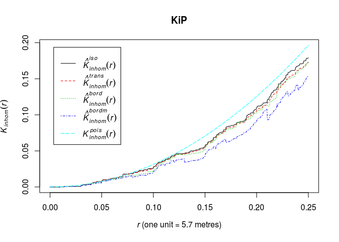

3.  Plot corresponding estimates of the inhomogeneous *L* function, using either `Linhom` or

    ``` r
    plot(KiS, sqrt(./pi) ~ r)
    ```

    and similarly for `KiP`.

    We use the inhomogenous *L*-function:

    ``` r
    par(mfrow=c(1,2))
    LiS <- Linhom(japanesepines)
    plot(LiS)

    LiP <- Kinhom(japanesepines, lambda)
    plot(LiP)
    ```

    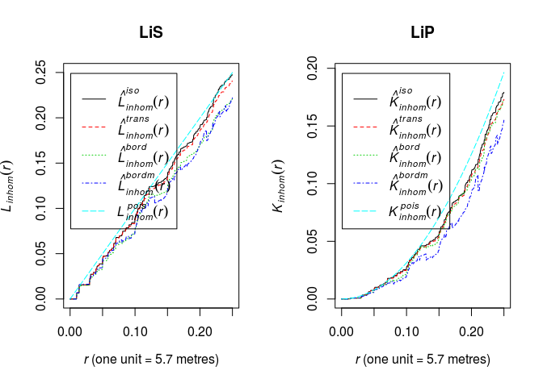

4.  Draw tentative conclusions about interpoint interaction.

    There seems to be no good evidence for any difference between the *L*-function under the Poisson model and the `japanesepines` point pattern.

### Exercise 4

To understand the difficulties with the *K*-function when the point pattern is not spatially homogeneous, try the following experiment.

1.  Generate a simulated realisation of an inhomogeneous Poisson process, e.g.

    ``` r
    X <- rpoispp(function(x,y){ 200 * exp(-3 * x) })
    ```

    OK,

    ``` r
    X <- rpoispp(function(x,y){ 200 * exp(-3 * x) })
    plot(X, main = "")
    ```

    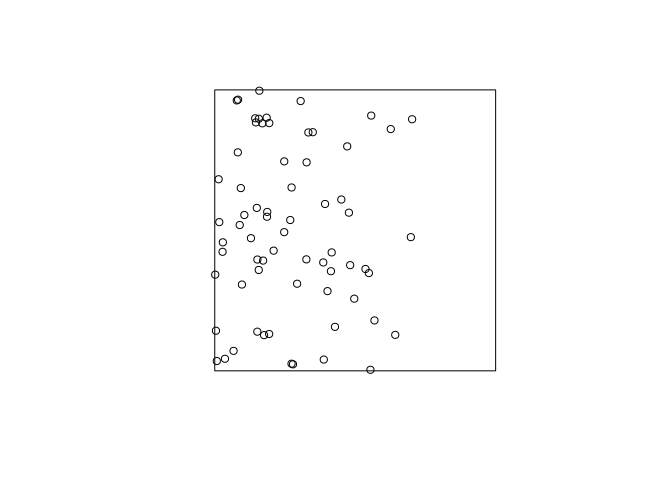

2.  Plot the *K*-function or *L*-function. It will most likely appear to show evidence of clustering.

    ``` r
    par(mfrow=c(1,2))
    plot(Kest(X))
    plot(Lest(X))
    ```

    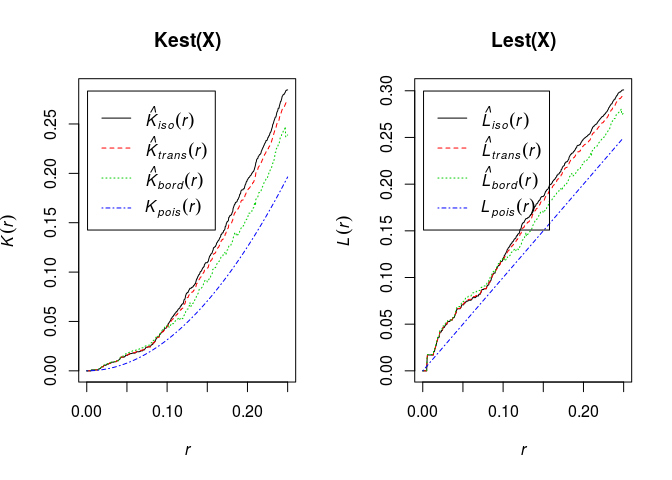

### Exercise 5

The cell process (`rcell`) has the same theoretical *K*-function as the uniform Poisson process.

1.  Read the help file

    OK, `help("rcell")`.

2.  Generate a simulated realisation of the cell process with a 10x10 grid of cells and plot it.

    The data is simulated (and plotted) with the `rcell` function and the following arguments:

    ``` r
    X <- rcell(win=square(1), nx = 10, nsim = 1)
    plot(X, main = "")
    ```

    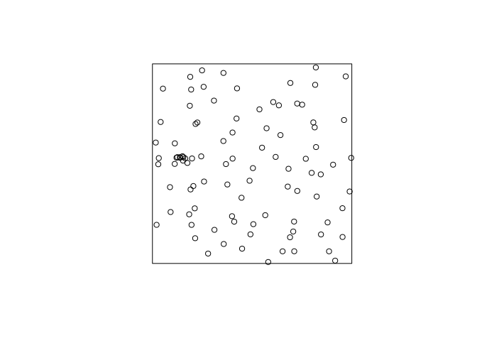

3.  Plot the *K* or *L*-function for this pattern, and determine whether it is distinguishable from a Poisson process.

    We simulate 19 poisson processes and plot these.

    ``` r
    lambda <- intensity(X)
    Y <- rpoispp(lambda, win = Window(X), nsim = 19)
    Y[[20]] <- X
    plot(Y, main = "")
    ```

    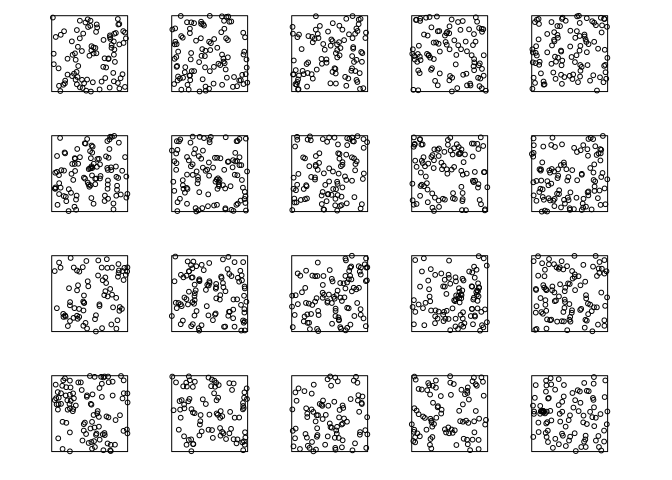

    Next, we compute the *K* and *L* functions and plot these:

    ``` r
    par(mfrow=c(1,2))
    plot(Kest(Y[[20]]), iso ~ r, col = "red")
    tmp <- sapply(lapply(Y[-20], Kest), plot, iso ~ r, add = TRUE, col="lightgrey")
    plot(Lest(Y[[20]]), iso ~ r, col = "red")
    tmp <- sapply(lapply(Y[-20], Lest), plot, iso ~ r, add = TRUE, col="lightgrey")
    ```

    

    Alternatively, one can simply do

    ``` r
    par(mfrow=c(1,2))
    plot(envelope(X, Kest))
    ```

        ## Generating 99 simulations of CSR  ...
        ## 1, 2, 3, 4, 5, 6, 7, 8, 9, 10, 11, 12, 13, 14, 15, 16, 17, 18, 19, 20, 21, 22, 23, 24, 25, 26, 27, 28, 29, 30, 31, 32, 33, 34, 35, 36, 37, 38,
        ## 39, 40, 41, 42, 43, 44, 45, 46, 47, 48, 49, 50, 51, 52, 53, 54, 55, 56, 57, 58, 59, 60, 61, 62, 63, 64, 65, 66, 67, 68, 69, 70, 71, 72, 73, 74, 75, 76,
        ## 77, 78, 79, 80, 81, 82, 83, 84, 85, 86, 87, 88, 89, 90, 91, 92, 93, 94, 95, 96, 97, 98,  99.
        ## 
        ## Done.

    ``` r
    plot(envelope(X, Lest))
    ```

        ## Generating 99 simulations of CSR  ...
        ## 1, 2, 3, 4, 5, 6, 7, 8, 9, 10, 11, 12, 13, 14, 15, 16, 17, 18, 19, 20, 21, 22, 23, 24, 25, 26, 27, 28, 29, 30, 31, 32, 33, 34, 35, 36, 37, 38,
        ## 39, 40, 41, 42, 43, 44, 45, 46, 47, 48, 49, 50, 51, 52, 53, 54, 55, 56, 57, 58, 59, 60, 61, 62, 63, 64, 65, 66, 67, 68, 69, 70, 71, 72, 73, 74, 75, 76,
        ## 77, 78, 79, 80, 81, 82, 83, 84, 85, 86, 87, 88, 89, 90, 91, 92, 93, 94, 95, 96, 97, 98,  99.
        ## 
        ## Done.

    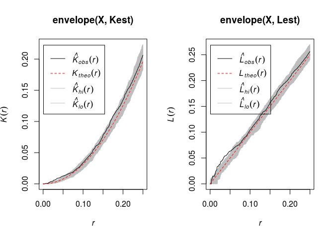
